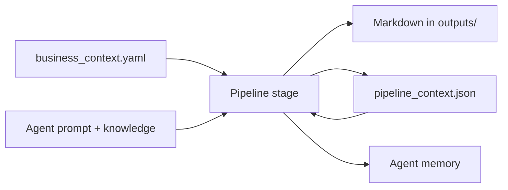

# Agent Forge

Local-first AI agent pipeline for designing, validating, and operating a high-ticket expert business.

Agent Forge turns structured business context into a sequence of market, offer, acquisition, delivery, and launch artifacts. It runs without API keys in deterministic mock mode and uses the Anthropic API for generated strategy documents.

Current version: 0.1.4

## What It Includes

- A packaged `agent-forge` CLI with 19 registered pipeline stages
- 23 agent directories covering market through launch (19 in the orchestrated CLI, 4 additional specialists)
- File-based agent prompts, knowledge, memory, checklists, and evals
- Mock mode for local development and CI — no API keys required
- Claude API mode for generated outputs
- Multi-source research engine (Reddit, YouTube, Google Trends, Facebook Ad Library, and 7 more)
- ResearchIndex RAG layer — SQLite FTS5 full-text search over collected references, no embedding API required
- Web tools layer with swappable providers (Tavily, Exa, Firecrawl, Playwright, Scrapy)
- Screenshot capture for competitor and funnel monitoring
- Morning briefing dashboard (Windows and macOS)
- Context compaction and structured inter-agent state
- Guardrails against fabricated claims, testimonials, scarcity, and income promises

The intended business flow is:

```text
market -> avatar -> offer -> proof -> acquisition -> sales
       -> delivery -> retention -> assessment -> specialists -> launch
```

## Requirements

- Python 3.11 or newer
- An Anthropic API key only when using `--mode api`

The TypeScript files under `tools/web/` define provider contracts and mock-safe adapters. The current pipeline and CLI runtime are Python-based.

## Installation

Clone the repository and install it in editable mode:

```bash
git clone https://github.com/cemalkarabulakli/agent_dev_boilerplate.git
cd agent_dev_boilerplate
```

Create and activate a virtual environment:

```bash
python -m venv .venv
```

```bash
# macOS/Linux
source .venv/bin/activate

# Windows PowerShell
.venv\Scripts\Activate.ps1
```

Install the application:

```bash
pip install -e .
```

For development and tests:

```bash
pip install -e ".[dev]"
```

Verify the install:

```bash
agent-forge version
agent-forge list
```

## Quick Start

### 1. Fill In The Business Context

`business_context.yaml` is the shared source of truth for every pipeline stage. It is JSON-compatible YAML and is **gitignored** — your real data stays local and is never committed.

Copy the example file to get started:

```bash
# macOS/Linux
cp business_context.example.yaml business_context.yaml

# Windows PowerShell
Copy-Item business_context.example.yaml business_context.yaml
```

Inspect it:

```bash
agent-forge context --show
```

Set individual values from the CLI:

```bash
agent-forge context --set "expert.niche=AI automation consulting"
agent-forge context --set "customer.target_customer=B2B SaaS founders"
agent-forge context --set "offer.current_price=5000 USD"
```

Unknown values should remain blank. Agents treat missing values as gaps instead of inventing facts.

### 2. Preview The Pipeline

```bash
agent-forge list
agent-forge build --dry-run
```

### 3. Run The Foundation In Mock Mode

Mock mode is local, deterministic, and requires no API key:

```bash
agent-forge build --mode mock --group foundation
```

Generated Markdown is written under `outputs/`. Structured summaries used by downstream agents are written to `pipeline_context.json`.

### 4. Check Progress

```bash
agent-forge status
```

The status view shows:

- business-context completion by section
- completed and pending pipeline stages
- upstream dependency gaps
- collected research signal counts

### 5. Run With Claude

The runtime reads credentials from the process environment. `.env.example` documents all supported variables but is not loaded automatically.

```bash
# macOS/Linux
export ANTHROPIC_API_KEY="your-key"

# Windows PowerShell
$env:ANTHROPIC_API_KEY="your-key"
```

Run one stage:

```bash
agent-forge run offer_architect --mode api
```

Run a pipeline group:

```bash
agent-forge build --mode api --group offer --confirm
```

API mode makes one model call per selected stage. Omit `--confirm` to receive an interactive cost prompt.

## Scenarios

The `scenarios/` directory contains step-by-step guides for common use patterns:

- AI automation consultant starting from scratch
- Validating a niche before building an offer
- Running research-first before pipeline stages
- Diagnosing a stalled funnel with `funnel_diagnostic_agent`
- Launching a Meta Ads campaign after the offer is locked

## CLI Reference

| Command | Purpose |
| --- | --- |
| `agent-forge version` | Print the installed version |
| `agent-forge init NAME` | Scaffold a project from the repository template |
| `agent-forge list` | List the 19 registered pipeline stages |
| `agent-forge status` | Show context, pipeline, and research status |
| `agent-forge context --show` | Display `business_context.yaml` |
| `agent-forge context --set section.field=value` | Update one context field |
| `agent-forge run AGENT` | Run one registered agent |
| `agent-forge build` | Run selected pipeline stages in dependency order |
| `agent-forge research SOURCE --query QUERY` | Collect signals from one research source |

Useful build selectors:

```bash
agent-forge build --group foundation,offer
agent-forge build --only market_selector,offer_architect
agent-forge build --skip-to funnel_builder
agent-forge build --no-memory
agent-forge build --stop-on-error
```

Use `agent-forge COMMAND --help` for the full option list.

## Pipeline

The CLI pipeline contains 19 registered stages:

| Group | Agents |
| --- | --- |
| Foundation | `market_selector`, `avatar_pain_researcher` |
| Offer | `offer_architect`, `value_stack_builder`, `pricing_guarantee_optimizer`, `proof_engine_builder` |
| Acquisition | `acquisition_strategy_agent`, `content_authority_agent`, `funnel_builder`, `sales_script_builder`, `objection_handler` |
| Delivery | `delivery_system_designer`, `retention_upsell_agent` |
| Assessment | `business_scorecard_agent` |
| Specialists | `meta_ads_manager`, `vsl_copywriter`, `case_study_writer`, `youtube_strategy_agent` |
| Launch | `launch_campaign_manager` |

Three additional agent directories exist outside the orchestrated pipeline and are available for direct use:

| Agent | Purpose |
| --- | --- |
| `vsl_events_copywriter` | VSL copy for paid live events |
| `funnel_diagnostic_agent` | Diagnose a live funnel bottleneck |
| `knowledge_integrator_agent` | Ingest external articles into agent knowledge bases |

`agent-forge list` is the source of truth for agents registered in the CLI pipeline.

### Inter-Agent Data Flow

Each stage declares the small set of upstream fields it reads and the structured fields it writes. The pipeline stores these summaries in `pipeline_context.json`; it does not pass complete Markdown documents between agents.



When a dependency has not run or did not produce a required field, the downstream output records an upstream gap and treats that value as unknown.

## Agent Layout

Each agent follows this structure:

```text
agents/<agent_name>/
  agent.yaml
  system_prompt.md
  checklist.yaml
  knowledge/
  memory/
    raw_history.jsonl
    session_notes.md
    long_term_memory.json
    compacted_context.md
  outputs/
  evals/
    eval_cases.yaml
```

`agent.yaml` defines the role, model settings, context, allowed tools, guardrails, and output format. Long-term memory entries remain candidates until reviewed; generated assumptions are not automatically promoted to business facts.

Create a new agent from the template:

```bash
python scripts/create_agent.py \
  --name sales_page_reviewer \
  --role "Sales Page Reviewer"
```

After editing the generated prompt, knowledge, checklist, and eval cases, validate the structure:

```bash
python scripts/validate_agent_structure.py
python scripts/run_checklist.py --agent sales_page_reviewer
python scripts/run_evals.py --agent sales_page_reviewer
```

Creating a directory does not automatically register the agent in the CLI pipeline. Registration requires adding its output template, dependency schema, generator mapping, and pipeline stage.

## Research Engine

Research sources are configured under `research/sources/` and registered in `research/index/source_registry.yaml`.

Included source adapters cover:

- Reddit
- Quora
- Google Trends
- YouTube
- web search
- GitHub trends
- Facebook Ad Library
- ClickBank
- BG-Mamma
- competitors
- custom sources

Collect one source:

```bash
agent-forge research reddit \
  --query "B2B founders struggling with customer acquisition" \
  --limit 10
```

Run all enabled sources and cross-source analysis:

```bash
python scripts/collect_all_sources.py --category high_ticket_business
python scripts/analyze_cross_source_signals.py
```

Run the weekly workflow locally:

```bash
python scripts/run_weekly_research.py
```

Monitor competitors and capture screenshots:

```bash
python scripts/monitor_competitors.py \
  --query "AI automation consulting"

python scripts/screenshot_page.py \
  --url "https://competitor.example.com"
```

Research artifacts are separated by purpose:

```text
research/sources/<source>/raw/         Original collected signals
research/sources/<source>/processed/   Normalized, scored signals
research/sources/<source>/reports/     Human-readable reports
research/index/                        References, run log, signal index
research/insights/                     Candidate/validated/rejected insights
```

Every collected signal retains a reference ID. Mock references use `mock://` URLs and `is_mock: true`. A one-source signal remains a candidate; strategy changes require independent validation and human review.

## ResearchIndex — RAG Search

`core/research_rag.py` exposes a `ResearchIndex` class backed by SQLite FTS5. It provides BM25-ranked keyword search over all entries in `research/index/collected_references.jsonl` without requiring an embedding API.

```bash
python scripts/search_research.py \
  --query "B2B SaaS acquisition bottlenecks" \
  --top-k 5
```

The index is rebuilt automatically when the JSONL file changes. Stats:

```bash
python scripts/search_research.py --stats
```

## Web Tools Layer

The web tools layer routes search, extraction, crawl, and browser tasks to swappable provider implementations. Provider selection is controlled by environment variables.

| Task type | Providers |
| --- | --- |
| Search | Tavily, SerpAPI, SearXNG, mock |
| Semantic search | Exa, mock |
| Extraction | Firecrawl, mock |
| Browser automation | Playwright, mock |
| Crawling | Scrapy, mock |

TypeScript interface contracts live under `tools/web/interfaces/`. Python adapters under `tools/adapters/` implement those contracts. The runtime accesses web capabilities only through the task router (`core/web/web_task_router.py`), never by importing provider SDKs directly.

Run a one-off search or extraction from the CLI:

```bash
python scripts/run_web_search.py \
  --query "high-ticket coaching funnels" \
  --provider tavily

python scripts/extract_webpage.py \
  --url "https://example.com/sales-page"

python scripts/compare_web_tools.py \
  --query "B2B lead generation"
```

## Morning Briefing

A local morning briefing shows pipeline progress, open gaps, and next recommended actions.

```bash
python scripts/morning_briefing.py
```

Set up a scheduled daily trigger:

```bash
# Windows
.\scripts\setup_morning_reminder.ps1

# macOS
bash scripts/setup_morning_reminder_macos.sh
```

## Direct Script Usage

The CLI is the preferred interface. Individual generators remain available for automation and debugging:

```bash
python scripts/generate_offer_audit.py \
  --mode mock \
  --context business_context.yaml

python scripts/generate_vsl_script.py \
  --mode api \
  --model claude-sonnet-4-6
```

Run the complete script-level pipeline:

```bash
python scripts/run_full_business_build.py --mode mock
```

Unlike the `agent-forge` CLI, individual generator scripts default to API mode and fall back to mock mode when `ANTHROPIC_API_KEY` is absent. Pass `--mode mock` explicitly for deterministic runs.

## Quality Checks

Run the full development checks:

```bash
python -m pytest
python scripts/validate_yaml.py
python scripts/validate_agent_structure.py
python scripts/run_checklist.py --all
python scripts/run_evals.py --all
```

Compact memory after long-running sessions:

```bash
python scripts/compact_context.py --agent offer_architect
python scripts/compact_context.py --all
```

Validation and checklist reports are written to `outputs/quality_reports/`.

## Dashboard

Start the read-only local dashboard:

```bash
python dashboard/server.py
```

Open [http://localhost:8765](http://localhost:8765). An optional port can be passed as the first argument:

```bash
python dashboard/server.py 9000
```

The dashboard displays available agents, pipeline progress, memory coverage, knowledge and eval status, research sources, notifications, and collected insights. See `DASHBOARD.md` for full documentation.

## Repository Map

```text
agent_forge/     Typer CLI and project scaffolding
agents/          Agent configurations, prompts, knowledge, memory, and evals (23 agents)
core/            Loading, schemas, pipeline state, memory, research, RAG, and quality logic
core/web/        Web task router, result normalizer, quality scorer, reference builder
scripts/         Generator, orchestration, research, validation, web tools, and release commands
tools/           Python source adapters and TypeScript web-tool contracts
tools/web/       Provider implementations: Tavily, Exa, Firecrawl, Playwright, Scrapy
research/        Source configuration, collected signals, references, and insights
knowledge/       Shared business and ethics knowledge
prompts/         Reusable prompt templates
checklists/      Global YAML quality gates
scenarios/       Step-by-step usage guides for common patterns
outputs/         Generated artifacts
dashboard/       Local HTTP dashboard
tests/           Pytest suite
```

Most `.yaml` files in this repository are JSON-compatible and are parsed through `core.schema.load_yaml()`. Preserve that format unless the loader is changed.

## Provider Configuration

Supported environment variables (see `.env.example` for the full list):

```text
# AI provider
ANTHROPIC_API_KEY
OPENAI_API_KEY
DEFAULT_MODEL_PROVIDER=mock
DEFAULT_MODEL_NAME=local-mock

# Web search
TAVILY_API_KEY
EXA_API_KEY
FIRECRAWL_API_KEY
SEARXNG_BASE_URL=http://localhost:8080

# Research sources
YOUTUBE_API_KEY
REDDIT_CLIENT_ID
REDDIT_CLIENT_SECRET
REDDIT_USER_AGENT
GITHUB_TOKEN
FACEBOOK_AD_LIBRARY_TOKEN
CLICKBANK_API_KEY

# Web tools provider selection
DEFAULT_SEARCH_PROVIDER=tavily
DEFAULT_SEMANTIC_SEARCH_PROVIDER=exa
DEFAULT_EXTRACTOR_PROVIDER=firecrawl
DEFAULT_BROWSER_PROVIDER=playwright
DEFAULT_CRAWLER_PROVIDER=scrapy

# Runtime modes
RESEARCH_MODE=mock
WEB_TOOLS_MODE=mock
SEARCH_TIMEOUT_MS=30000
AUTO_APPROVE_INSIGHTS=false
```

The current generated-output API path uses Anthropic. Other keys support research adapters or web-tool providers. Agents should depend on the interfaces and registries under `tools/web/`, not import provider SDKs directly.

## Safety And Review Rules

Do not:

- invent claims, testimonials, scarcity, or income outcomes
- treat mock data as live evidence
- treat one-source signals as validated
- insert raw research dumps into compacted context
- store unnecessary personal data
- bypass the reference manager for collected research

Do:

- leave unknown context fields blank
- label assumptions and missing dependencies
- preserve source URLs and reference IDs
- keep raw and processed research separate
- require human review before accepting durable memories or strategy changes
- respect source terms, access policies, and legal constraints

## License

Released under the [MIT License](LICENSE).
