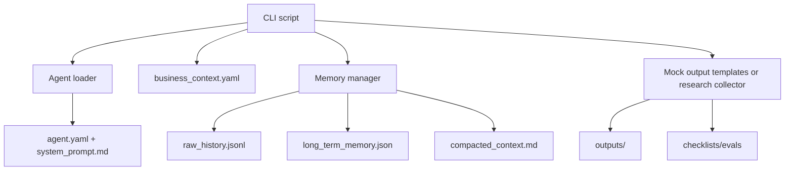
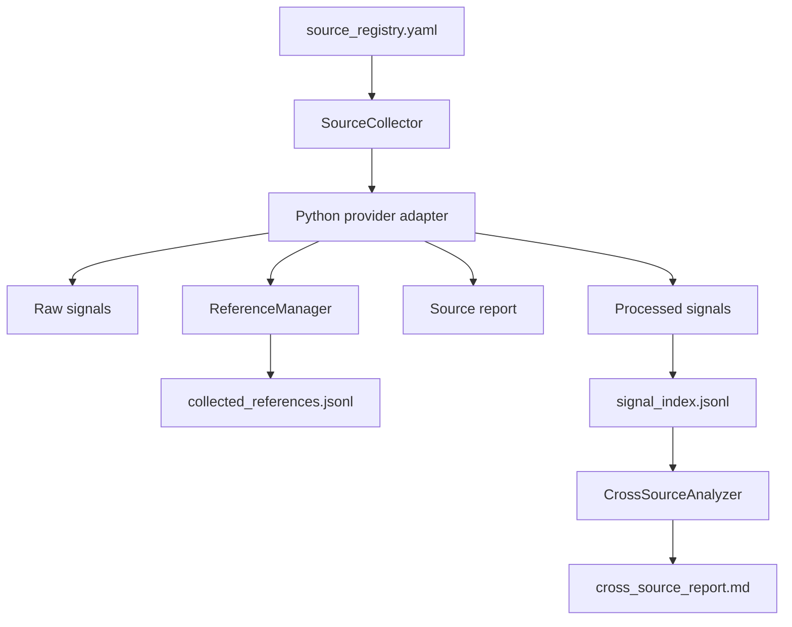

# High-Ticket Expert Growth System

Local-first AI agent template system for experts who want to build, improve, and scale a high-ticket business using structured business thinking, file-based memory, evidence-driven research, ethical marketing rules, and modular web tooling.

This repository is designed to be pushed to GitHub and run locally without API keys. It defaults to deterministic mock mode, then can be upgraded later with real LLM providers, search APIs, extraction APIs, browser automation, crawlers, databases, vector stores, or production orchestration.

## Table Of Contents

- [What This System Is](#what-this-system-is)
- [Core Philosophy](#core-philosophy)
- [High-Ticket Business Flow](#high-ticket-business-flow)
- [Repository Map](#repository-map)
- [Quick Start](#quick-start)
- [Business Context](#business-context)
- [Agent System](#agent-system)
- [Runtime Architecture](#runtime-architecture)
- [Memory System](#memory-system)
- [Context Compaction](#context-compaction)
- [Knowledge System](#knowledge-system)
- [Mock Mode](#mock-mode)
- [Output Generators](#output-generators)
- [Research Engine](#research-engine)
- [Web Tooling Layer](#web-tooling-layer)
- [Competitor Monitoring](#competitor-monitoring)
- [References And Evidence](#references-and-evidence)
- [Checklists And Quality Gates](#checklists-and-quality-gates)
- [Tests And Evals](#tests-and-evals)
- [GitHub Actions](#github-actions)
- [Command Reference](#command-reference)
- [How To Add A New Agent](#how-to-add-a-new-agent)
- [How To Add A New Research Source](#how-to-add-a-new-research-source)
- [How To Add Real Providers Later](#how-to-add-real-providers-later)
- [Safety And Ethics](#safety-and-ethics)
- [Developer Notes](#developer-notes)

## What This System Is

This project is a reusable local-first AI agent factory for high-ticket expert businesses.

It helps operators reason through:

- market selection
- customer avatar
- painful and expensive problem
- high-ticket offer
- value stack
- pricing and guarantee
- proof engine
- acquisition
- content authority
- funnel
- sales process
- delivery system
- retention and upsell
- business scorecard
- evidence-based market research
- competitor monitoring

It is not a generic chatbot template. It is an agent system built around the high-ticket expert business sequence:

```text
market -> avatar -> painful problem -> high-value offer -> proof -> acquisition -> sales -> delivery -> retention -> scale
```

## Core Philosophy

The system follows these engineering rules:

- Local-first: files are the source of truth in v1.
- Mock-first: every script should run without API keys.
- Evidence-first: research insights need references before they can influence strategy.
- Interface-first: agents must use abstract tool contracts, not provider SDKs directly.
- Human-review-first: candidate insights are not automatically accepted as business facts.
- Safety-first: no fake claims, fake scarcity, fake testimonials, or unsupported income promises.

The system follows these business rules:

- Choose a market before building the offer.
- Clarify the avatar before writing copy.
- Improve the offer before scaling traffic.
- Build proof before scaling claims.
- Build delivery before overpromising.
- Label assumptions when data is missing.
- Use research to validate strategy, not to invent certainty.

## High-Ticket Business Flow

Use the system in this order when starting from zero:

1. Fill `business_context.yaml` with what you know.
2. Run the market scorecard.
3. Run avatar and pain research.
4. Run the offer audit.
5. Build the value stack.
6. Review pricing and guarantee.
7. Build acquisition, content, funnel, and sales assets.
8. Design delivery and proof systems.
9. Run the business scorecard.
10. Collect research signals.
11. Run cross-source analysis.
12. Update strategy only after human review.

## Repository Map

```text
agents/
  _template/                         Reusable starter agent
  market_selector/                   Market selection agent
  avatar_pain_researcher/            Avatar and pain research agent
  offer_architect/                   High-ticket offer agent
  value_stack_builder/               Value stack agent
  pricing_guarantee_optimizer/       Pricing and risk reversal agent
  acquisition_strategy_agent/        Lead generation strategy agent
  content_authority_agent/           Authority content strategy agent
  funnel_builder/                    Funnel mapping agent
  sales_script_builder/              Sales call script agent
  objection_handler/                 Objection handling agent
  proof_engine_builder/              Ethical proof engine agent
  delivery_system_designer/          Delivery system agent
  retention_upsell_agent/            Retention and upsell agent
  business_scorecard_agent/          Bottleneck and scorecard agent

core/
  agent_loader.py                    Agent config and prompt loading
  schema.py                          Core dataclasses and validation
  business_context_schema.py         business_context.yaml validation
  memory_manager.py                  File-based raw/session/long-term memory
  context_compactor.py               Structured context compaction
  output_templates.py                Deterministic mock outputs
  checklist_runner.py                Checklist quality gate engine
  source_registry.py                 Research source registry access
  source_collector.py                Python source collection runner
  reference_manager.py               Reference index manager
  cross_source_analyzer.py           Cross-source signal analysis
  source_signal_scorer.py            Candidate/validated scoring
  competitor_monitor.py              Competitor monitoring flow
  research_reporter.py               Markdown report helper
  guardrails.py                      Input/tool/output guardrail helpers
  logger.py                          Simple logging helper

tools/
  adapters/research_sources/         Python source providers used by CLIs
  web/interfaces/                    TypeScript abstract tool interfaces
  web/types/                         TypeScript result and signal types
  web/search/                        Tavily, SerpAPI, mock search providers
  web/extraction/                    Firecrawl and mock extraction providers
  web/browser/                       Playwright and mock browser providers
  web/crawling/                      Scrapy and mock crawler placeholders
  web/sources/                       TypeScript source provider contracts
  web/registry/                      Web and source provider factories
  web/config/                        Environment-driven provider config

research/
  sources/{source}/raw/              Raw source files
  sources/{source}/processed/        Processed source signals
  sources/{source}/reports/          Per-source Markdown reports
  sources/competitors/screenshots/   Optional screenshot artifacts
  index/source_registry.yaml         Source registry
  index/collected_references.jsonl   Append-only reference index
  index/source_run_log.jsonl         Source run log
  index/signal_index.jsonl           Processed signal index
  processed/                         Cross-source and topic reports
  insights/                          Candidate, validated, rejected insights

knowledge/                           Local high-ticket business knowledge placeholders
prompts/                             Prompt templates
checklists/                          YAML quality gates
scripts/                             CLI entrypoints
outputs/                             Generated artifacts
tests/                               Pytest suite
.github/workflows/                  CI, quality, research, optimization workflows
```

Important implementation detail: many `.yaml` files are JSON-compatible YAML and are parsed with `json.loads()` through `core.schema.load_yaml()`. Keep those files valid JSON unless you update the loader.

## Quick Start

Install dependencies:

```bash
pip install -r requirements.txt
```

Run all tests:

```bash
python -m pytest
```

Validate YAML-style config files:

```bash
python scripts/validate_yaml.py
```

Validate agent structure:

```bash
python scripts/validate_agent_structure.py
```

Run the main checklist suite:

```bash
python scripts/run_checklist.py --all
```

Run all evals:

```bash
python scripts/run_evals.py --all
```

## Business Context

`business_context.yaml` is the local business data template. It is intentionally blank by default and contains no personal or business-specific data.

Main sections:

- `expert`: niche, expertise, credibility, channels, delivery strengths
- `market`: market name, urgency, ability to pay, accessibility, competitors
- `customer`: target customer, avatar, current situation, pains, dream outcome, objections
- `offer`: current offer, price, delivery model, promise, mechanism, proof, guarantee
- `business`: revenue range, model, capacity, team, bottleneck
- `acquisition`: lead sources, content channels, ads, outbound, partnerships
- `sales`: sales process, application, close rate, objections, follow-up
- `delivery`: onboarding, milestones, success metrics, support, risks
- `retention`: upsells, continuity, community, referrals
- `constraints`: budget, time, legal and ethical limits
- `metrics`: leads, booked calls, show-up rate, AOV, LTV, CAC-style metrics
- `notes`: assumptions, open questions, rejected ideas

Rule: leave unknown fields blank. The mock generator and agents should label gaps as unknown instead of inventing facts.

## Agent System

Each agent directory follows the same local-first layout:

```text
agents/{agent}/
  agent.yaml
  system_prompt.md
  checklist.yaml
  knowledge/
  memory/
    raw_history.jsonl
    session_notes.md
    long_term_memory.json
    compacted_context.md
  outputs/
  evals/
    eval_cases.yaml
```

`agent.yaml` defines:

- `name`
- `role`
- `description`
- `model`
- `context`
- `memory`
- `knowledge`
- `tools.allowed`
- input and output guardrails
- default output format

Current starter agents:

| Agent | Purpose |
| --- | --- |
| `market_selector` | Scores market pain, urgency, ability to pay, reachability, competition, transformation potential |
| `avatar_pain_researcher` | Clarifies avatar, pains, objections, triggers, customer language |
| `offer_architect` | Builds or audits high-ticket offers |
| `value_stack_builder` | Builds the core offer stack, assets, bonuses, support, risk reducers |
| `pricing_guarantee_optimizer` | Reviews price, payment plans, guarantee, risk reversal, profitability |
| `acquisition_strategy_agent` | Chooses lead sources and weekly acquisition actions |
| `content_authority_agent` | Designs authority, proof, objection, demand, and CTA content |
| `funnel_builder` | Maps lead magnet, workshop, application, booking, email, sales flow |
| `sales_script_builder` | Creates ethical qualification and sales call scripts |
| `objection_handler` | Builds objection banks and ethical responses |
| `proof_engine_builder` | Designs proof collection and ethical claims process |
| `delivery_system_designer` | Designs onboarding, milestones, support, SOPs, success metrics |
| `retention_upsell_agent` | Designs continuity, upsells, referrals, expansion paths |
| `business_scorecard_agent` | Scores the business and identifies bottlenecks |

## Runtime Architecture

The runtime is intentionally simple:



Key modules:

| Module | Responsibility |
| --- | --- |
| `core.agent_loader` | Locate and load agent configs and prompts |
| `core.schema` | Dataclasses and validation for configs, memory, checklists, evals |
| `core.business_context_schema` | Validate `business_context.yaml` required sections |
| `core.memory_manager` | Append raw history, save candidate memories, read/write context |
| `core.context_compactor` | Convert raw history to compact high-ticket business context |
| `core.output_templates` | Deterministic local mock outputs for starter agents |
| `core.checklist_runner` | Run global and agent-specific quality gates |
| `core.guardrails` | Validate basic input/tool/output safety rules |

## Memory System

Each agent has four memory files:

| File | Purpose |
| --- | --- |
| `raw_history.jsonl` | Append-only interaction log |
| `session_notes.md` | Editable temporary notes |
| `long_term_memory.json` | Candidate, accepted, or rejected durable facts |
| `compacted_context.md` | Regenerable compressed context for model input |

Memory entry shape:

```json
{
  "id": "mem_...",
  "type": "market|avatar|offer|pricing|guarantee|acquisition|funnel|sales|delivery|proof|retention|decision|constraint|metric|assumption",
  "text": "",
  "source": "user|agent|tool|business_context",
  "confidence": 0.0,
  "created_at": "",
  "updated_at": "",
  "status": "candidate|accepted|rejected"
}
```

Important rule: candidate memories are not accepted facts. Human review is required before durable business facts are treated as accepted.

## Context Compaction

`core.context_compactor` preserves business-critical state while reducing context size.

It keeps:

- recent user turns verbatim
- market, niche, avatar, pain, expensive problem
- dream outcome, offer, price, value stack, guarantee
- proof, acquisition, funnel, sales, delivery, retention
- constraints, metrics, open questions, open tasks
- rejected ideas, assumptions, decisions
- processed research insights with references and confidence scores

It removes:

- greetings
- repeated confirmations
- raw research dumps
- verbose source output
- vague motivational text
- rejected temporary brainstorming when not useful

Compacted context sections include:

- `Business Snapshot`
- `Market`
- `Specific Avatar`
- `Current Offer`
- `Pricing Decisions`
- `Research Insights`
- `Source References`
- `Validated Trends`
- `Candidate Trends`
- `Tool Opportunities`
- `Ad Angle Signals`
- `Customer Language Signals`
- `Competitor Signals`
- `Recent Verbatim Turns`
- `Validation Checklist`

Run compaction:

```bash
python scripts/compact_context.py --agent offer_architect
python scripts/compact_context.py --all
```

Validation reports are written to `outputs/quality_reports/`.

## Knowledge System

The `knowledge/` directory contains local placeholder knowledge for high-ticket business strategy. These files are not treated as external facts unless source labels and evidence are added.

Categories:

- `market`
- `avatar`
- `offer`
- `acquisition`
- `funnel`
- `sales`
- `delivery`
- `proof`
- `retention`
- `ethics`

Agent-specific knowledge lives under `agents/{agent}/knowledge/`.

Rule: do not add fake facts, fake testimonials, fake benchmarks, or fabricated market claims.

## Mock Mode

The system is mock/local by default.

Default environment:

```text
DEFAULT_MODEL_PROVIDER=mock
DEFAULT_MODEL_NAME=local-mock
RESEARCH_MODE=mock
WEB_TOOLS_MODE=mock
```

Mock mode means:

- no API keys required
- deterministic local outputs
- mock research signals labeled as mock
- `mock://...` URLs for mock references
- reports still save raw, processed, references, and outputs
- tests can run without network access

## Output Generators

The generator scripts use `business_context.yaml` and `core.output_templates` to create deterministic Markdown outputs.

| Script | Agent | Output folder |
| --- | --- | --- |
| `generate_market_scorecard.py` | `market_selector` | `outputs/market_scorecards/` |
| `generate_avatar_research.py` | `avatar_pain_researcher` | `outputs/avatar_research/` |
| `generate_offer_audit.py` | `offer_architect` | `outputs/offer_audits/` |
| `generate_value_stack.py` | `value_stack_builder` | `outputs/value_stacks/` |
| `generate_pricing_guarantee_review.py` | `pricing_guarantee_optimizer` | `outputs/pricing_reviews/` |
| `generate_acquisition_plan.py` | `acquisition_strategy_agent` | `outputs/acquisition_plans/` |
| `generate_content_plan.py` | `content_authority_agent` | `outputs/content_plans/` |
| `generate_funnel_map.py` | `funnel_builder` | `outputs/funnel_maps/` |
| `generate_sales_script.py` | `sales_script_builder` | `outputs/sales_scripts/` |
| `generate_objection_bank.py` | `objection_handler` | `outputs/objection_banks/` |
| `generate_delivery_system.py` | `delivery_system_designer` | `outputs/delivery_systems/` |
| `generate_proof_engine.py` | `proof_engine_builder` | `outputs/proof_engines/` |
| `generate_business_scorecard.py` | `business_scorecard_agent` | `outputs/business_scorecards/` |

Example:

```bash
python scripts/generate_offer_audit.py --agent offer_architect --context business_context.yaml
```

Use `--no-memory` in deterministic test contexts:

```bash
python scripts/generate_offer_audit.py --agent offer_architect --context business_context.yaml --no-memory
```

## Research Engine

The research engine collects source-based market signals and stores four kinds of artifacts for each source:

```text
research/sources/{source}/raw/
research/sources/{source}/processed/
research/sources/{source}/reports/
research/index/collected_references.jsonl
```

Current sources:

| Source | Registry ID | Best for |
| --- | --- | --- |
| Quora | `quora` | customer questions, pain language, objections, education gaps |
| BG-Mamma | `bg_mamma` | Bulgarian market signals, local language, community discussions |
| Facebook Ad Library | `facebook_ad_library` | competitor ads, ad angles, creative patterns, offer positioning |
| Reddit | `reddit` | raw pain language, objections, buying frustrations |
| Google Trends | `google_trends` | demand direction, seasonality, regional interest |
| GitHub Trends | `github_trends` | tool discovery, open-source trends, developer adoption |
| ClickBank | `clickbank` | digital product categories, affiliate offers, niche monetization |
| YouTube | `youtube` | content trends, hooks, authority topics |
| Web Search | `web_search` | source discovery, official docs, competitors, tools |
| Competitors | `competitors` | landing pages, pricing pages, positioning, screenshots |

Research flow:



Collect one source:

```bash
python scripts/collect_source.py --source reddit --query "coaches struggling to get clients"
```

Collect all enabled sources:

```bash
python scripts/collect_all_sources.py --category high_ticket_business
```

Analyze cross-source signals:

```bash
python scripts/analyze_cross_source_signals.py
```

Run weekly research:

```bash
python scripts/run_weekly_research.py
```

## Web Tooling Layer

The `tools/web/` layer defines TypeScript contracts for future web-enabled agents and applications.

Agents should depend on interfaces only:

- `WebSearchTool`
- `WebExtractorTool`
- `BrowserAutomationTool`
- `WebCrawlerTool`
- `SourceCollectorTool`
- `TrendProviderTool`

Agents should not directly import:

- Tavily SDKs
- Firecrawl SDKs
- Playwright SDKs
- Scrapy internals
- Reddit API SDKs
- YouTube API SDKs
- source-specific SDKs

Provider decision model:

| Need | Default tool |
| --- | --- |
| Find public web information | Tavily |
| Find latest public context | Tavily |
| Discover competitors | Tavily |
| Get Google-style SERP data | SerpAPI |
| Extract clean Markdown from a page | Firecrawl |
| Analyze landing/pricing/docs pages | Firecrawl |
| Click, type, log in, screenshot, PDF | Playwright |
| JavaScript-heavy browser workflows | Playwright |
| Large scheduled crawling | Scrapy |
| Local tests and no API keys | Mock providers |

Mental model:

```text
Tavily = find and understand information
Firecrawl = turn websites into clean LLM-ready Markdown
Playwright = operate a browser like a human
Scrapy = large-scale custom crawler infrastructure
```

Registry example:

```ts
import { createWebTools } from "./tools/web/registry/web_tool_registry";

const tools = createWebTools();
const results = await tools.search.search("best AI automation agencies in Bulgaria");
const page = await tools.extraction.extract("https://example.com/pricing");
await tools.browser.open("https://example.com");
```

Source provider registry example:

```ts
import { createSourceTools } from "./tools/web/registry/source_provider_registry";

const sources = createSourceTools();
const raw = await sources.reddit.collect("coaches struggling to get clients");
const processed = await sources.reddit.process(raw);
```

Current TypeScript providers are mock-safe placeholders. Live implementation can be added behind the same interfaces.

## Competitor Monitoring

Competitor monitoring is implemented in `core.competitor_monitor` and exposed by `scripts/monitor_competitors.py`.

Workflow:

1. Search competitors with Tavily or mock search.
2. Extract home, landing, and pricing page content with Firecrawl or mock extraction.
3. Use Playwright only when screenshots, PDFs, JavaScript interaction, or visual monitoring is needed.
4. Save raw results under `research/sources/competitors/raw/`.
5. Save processed insights under `research/sources/competitors/processed/`.
6. Save reports under `research/sources/competitors/reports/`.
7. Save optional screenshots under `research/sources/competitors/screenshots/`.
8. Save user-facing reports under `outputs/competitor_monitoring/`.
9. Register references in `research/index/collected_references.jsonl`.

Run:

```bash
python scripts/monitor_competitors.py --query "AI automation agency Bulgaria"
python scripts/monitor_competitors.py --query "AI automation agency Bulgaria" --screenshots
```

## References And Evidence

Every collected item should produce a reference entry in:

```text
research/index/collected_references.jsonl
```

Reference shape:

```json
{
  "id": "ref_2026_05_21_0001",
  "source": "reddit",
  "source_type": "community",
  "query": "coaches struggling to get clients",
  "title": "",
  "url": "",
  "author_or_channel": "",
  "collected_at": "",
  "published_at": "",
  "raw_file": "",
  "processed_file": "",
  "confidence": 0.55,
  "is_mock": true,
  "notes": "Mock mode reference."
}
```

Rules:

- every raw signal has `reference_id`
- every processed signal has `reference_ids`
- every source report has `## References`
- mock URLs use `mock://...`
- mock references set `is_mock: true`
- uncited research should not become strategy
- one-source signals stay candidate
- validated signals require multiple independent sources and acceptable confidence

## Checklists And Quality Gates

Checklists live under `checklists/` and are run by `core.checklist_runner`.

Important checklists:

| Checklist | Purpose |
| --- | --- |
| `market_quality_checklist.yaml` | Market urgency, reachability, spending, transformation |
| `avatar_clarity_checklist.yaml` | Specific avatar, pain, objections, buying triggers |
| `high_ticket_offer_checklist.yaml` | Offer clarity, value, proof, price, ethical claims |
| `ethical_marketing_checklist.yaml` | No fake claims, scarcity, testimonials, income promises |
| `research_source_checklist.yaml` | Source folders, config, providers, mock mode, compliance |
| `reference_integrity_checklist.yaml` | Reference IDs, raw files, mock URL labels |
| `cross_source_validation_checklist.yaml` | Candidate/validated labeling, source count, confidence |
| `web_tool_provider_checklist.yaml` | Interfaces, registries, env vars, mock providers |
| `competitor_monitoring_checklist.yaml` | Competitor source, raw/processed/reports/screenshots |
| `github_ready_checklist.yaml` | Tests, workflows, `.env.example`, no secrets |

Run one checklist:

```bash
python scripts/run_checklist.py --checklist research_source_checklist
```

Run all agent checklists:

```bash
python scripts/run_checklist.py --all
```

## Tests And Evals

Tests live under `tests/`.

Coverage includes:

- agent folder structure
- YAML validation
- business context validation
- context compaction
- memory manager
- checklist runner
- script mock mode
- research source structure
- reference manager
- cross-source analyzer
- add research source
- weekly research
- web tool interfaces
- web tool registry
- source provider registry
- competitor monitoring

Run:

```bash
python -m pytest
```

Agent evals live in `agents/{agent}/evals/eval_cases.yaml`.

Run evals:

```bash
python scripts/run_evals.py --agent offer_architect
python scripts/run_evals.py --all
```

## GitHub Actions

Workflows are stored as JSON-compatible YAML files under `.github/workflows/`.

| Workflow | Trigger | Purpose |
| --- | --- | --- |
| `ci.yml` | push, pull_request | Install dependencies, run tests, validate YAML, validate agent structure |
| `agent-quality-check.yml` | push | Run all checklists and evals, upload quality reports |
| `scheduled-optimization.yml` | weekly Monday `17 3 * * 1`, manual | Compact contexts, run checklists, upload optimization reports |
| `weekly-research.yml` | weekly Monday `23 4 * * 1`, manual | Run source collection, cross-source analysis, upload research artifacts |
| `competitor-monitoring.yml` | weekly Tuesday `31 5 * * 2`, manual | Run competitor monitoring, upload competitor artifacts |
| `source-integrity-check.yml` | push, pull_request | Run research, reference, web tool, competitor checks and targeted tests |

Workflow rules:

- no auto-commit by default
- no push to `main`
- no automatic approval of insights
- no automatic edits to `business_context.yaml`
- reports are uploaded as artifacts

## Command Reference

Install:

```bash
pip install -r requirements.txt
```

Create a new agent:

```bash
python scripts/create_agent.py --name sales_page_reviewer --role "Sales Page Reviewer"
```

Run an agent in mock mode:

```bash
python scripts/run_agent.py --agent offer_architect --message "Audit my current offer"
```

Generate strategy outputs:

```bash
python scripts/generate_market_scorecard.py --agent market_selector --context business_context.yaml
python scripts/generate_avatar_research.py --agent avatar_pain_researcher --context business_context.yaml
python scripts/generate_offer_audit.py --agent offer_architect --context business_context.yaml
python scripts/generate_value_stack.py --agent value_stack_builder --context business_context.yaml
python scripts/generate_pricing_guarantee_review.py --agent pricing_guarantee_optimizer --context business_context.yaml
python scripts/generate_acquisition_plan.py --agent acquisition_strategy_agent --context business_context.yaml
python scripts/generate_content_plan.py --agent content_authority_agent --context business_context.yaml
python scripts/generate_funnel_map.py --agent funnel_builder --context business_context.yaml
python scripts/generate_sales_script.py --agent sales_script_builder --context business_context.yaml
python scripts/generate_objection_bank.py --agent objection_handler --context business_context.yaml
python scripts/generate_delivery_system.py --agent delivery_system_designer --context business_context.yaml
python scripts/generate_proof_engine.py --agent proof_engine_builder --context business_context.yaml
python scripts/generate_business_scorecard.py --agent business_scorecard_agent --context business_context.yaml
```

Research:

```bash
python scripts/collect_source.py --source reddit --query "coaches struggling to get clients"
python scripts/collect_source.py --source bg_mamma --query "детски английски курс"
python scripts/collect_source.py --source facebook_ad_library --query "fitness coaching"
python scripts/collect_source.py --source youtube --query "high ticket coaching funnel"
python scripts/collect_all_sources.py --category high_ticket_business
python scripts/analyze_cross_source_signals.py
python scripts/run_weekly_research.py
```

Competitors:

```bash
python scripts/monitor_competitors.py --query "AI automation agency Bulgaria"
```

Quality:

```bash
python scripts/compact_context.py --agent offer_architect
python scripts/compact_context.py --all
python scripts/run_checklist.py --agent offer_architect
python scripts/run_checklist.py --all
python scripts/run_checklist.py --checklist web_tool_provider_checklist
python scripts/run_evals.py --all
python scripts/validate_yaml.py
python scripts/validate_agent_structure.py
python -m pytest
```

## How To Add A New Agent

Use the template:

```bash
python scripts/create_agent.py --name sales_page_reviewer --role "Sales Page Reviewer"
```

Then edit:

- `agents/sales_page_reviewer/agent.yaml`
- `agents/sales_page_reviewer/system_prompt.md`
- `agents/sales_page_reviewer/checklist.yaml`
- `agents/sales_page_reviewer/evals/eval_cases.yaml`
- `agents/sales_page_reviewer/knowledge/`

Checklist:

- keep provider mode as `mock` unless a real provider is explicitly implemented
- keep guardrails for fake claims, fake testimonials, fake scarcity, and unrealistic outcomes
- define output sections clearly
- add eval cases for required sections and forbidden terms
- run tests and checklist validation

## How To Add A New Research Source

Use:

```bash
python scripts/add_research_source.py --id tiktok --name "TikTok" --type "short_video"
```

This creates:

- `research/sources/tiktok/source_config.yaml`
- `research/sources/tiktok/raw/`
- `research/sources/tiktok/processed/`
- `research/sources/tiktok/reports/`
- `tools/adapters/research_sources/tiktok_source_provider.py`
- `tools/web/sources/tiktok_source_provider.ts`
- registry entry in `research/index/source_registry.yaml`
- checklist placeholder

After adding a source:

```bash
python scripts/validate_yaml.py
python scripts/run_checklist.py --checklist research_source_checklist
python -m pytest tests/test_research_sources.py
```

## How To Add Real Providers Later

The project currently includes mock-safe placeholders. Add live integrations behind existing interfaces.

Search:

- implement live Tavily calls in `tools/web/search/tavily_search_provider.ts`
- implement live SerpAPI calls in `tools/web/search/serpapi_search_provider.ts`
- keep `MockSearchProvider` as fallback

Extraction:

- implement live Firecrawl calls in `tools/web/extraction/firecrawl_extractor_provider.ts`
- keep `MockExtractorProvider` as fallback

Browser:

- add Playwright dependency
- implement browser lifecycle in `tools/web/browser/playwright_browser_provider.ts`
- keep `MockBrowserProvider` for tests and no-key mode

Crawling:

- add Scrapy dependency only if needed
- implement self-hosted crawling in `tools/web/crawling/scrapy_crawler_provider.py`
- keep `MockCrawlerProvider` for tests

Source collection:

- update the Python source provider in `tools/adapters/research_sources/`
- update the TypeScript source provider in `tools/web/sources/`
- keep the same signal and reference fields
- never bypass `ReferenceManager`

Environment variables:

```text
TAVILY_API_KEY=
SERPAPI_API_KEY=
FIRECRAWL_API_KEY=
YOUTUBE_API_KEY=
REDDIT_CLIENT_ID=
REDDIT_CLIENT_SECRET=
REDDIT_USER_AGENT=
GITHUB_TOKEN=
FACEBOOK_AD_LIBRARY_TOKEN=
CLICKBANK_API_KEY=
RESEARCH_MODE=mock
WEB_TOOLS_MODE=mock
```

## Safety And Ethics

The system intentionally blocks or labels unsafe behavior.

Do not:

- add fake claims
- add fake testimonials
- add fake scarcity
- add unsupported income promises
- store unnecessary personal data
- treat mock signals as live evidence
- treat one-source research as validated
- inject raw research dumps into compacted context
- let agents call provider SDKs directly

Do:

- cite references
- label assumptions
- label mock data
- preserve source URLs
- require human review before strategy updates
- keep raw and processed data separate
- use official APIs or allowed public access
- respect source terms and robots rules

## Developer Notes

Generated outputs are ignored by `.gitignore`:

- `outputs/**/*.md`
- `outputs/**/*.json`
- `research/sources/*/raw/*.json`
- `research/sources/*/processed/*.json`
- `research/sources/*/reports/*.md`
- `research/sources/*/screenshots/*`
- `research/processed/**/*.md`

Tracked `.gitkeep` files preserve required folders.

`todo_tools.md` is currently untracked local work and is not part of the committed project documentation.

Before committing changes, run:

```bash
python scripts/validate_yaml.py
python scripts/validate_agent_structure.py
python scripts/run_checklist.py --checklist research_source_checklist
python scripts/run_checklist.py --checklist reference_integrity_checklist
python scripts/run_checklist.py --checklist cross_source_validation_checklist
python scripts/run_checklist.py --checklist web_tool_provider_checklist
python scripts/run_checklist.py --checklist competitor_monitoring_checklist
python -m pytest
```
